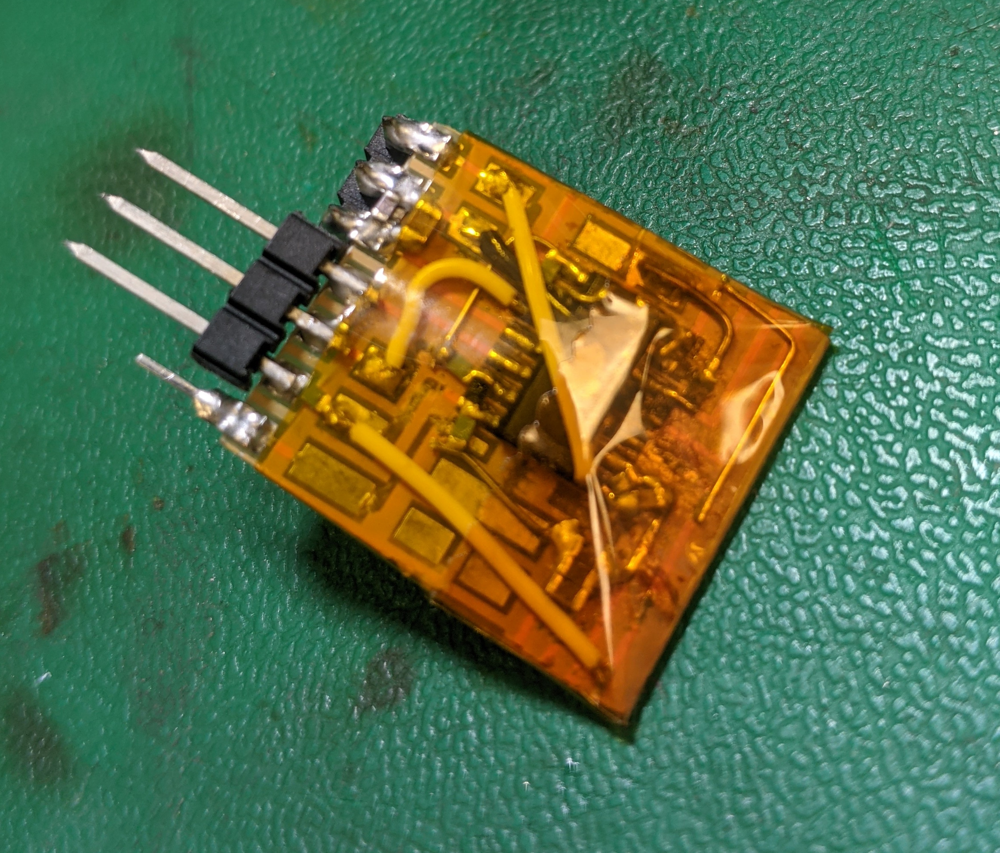
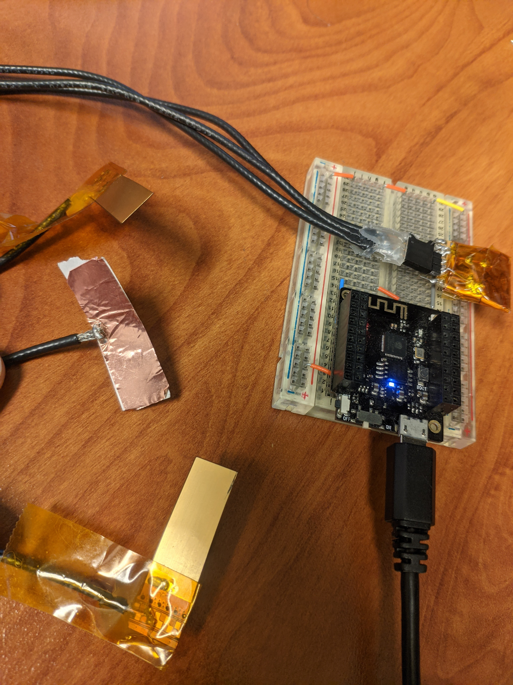
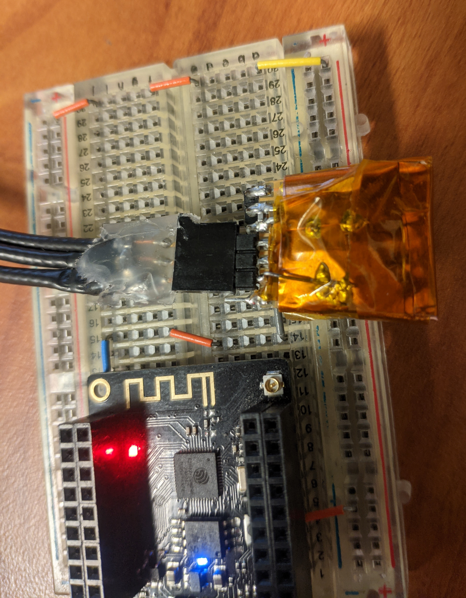
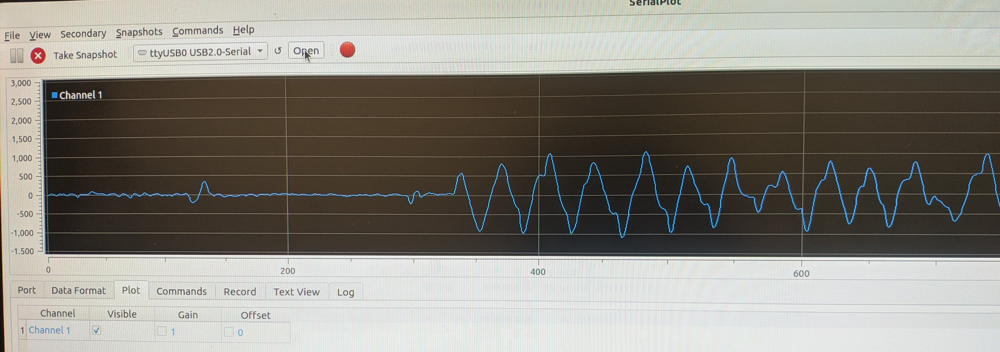

# Nystagmus Aid
## Summary
This project is an experiment in reducing the focal variance of incoming light for those with Nystagmus.  Using EOG and active 3d shutter glasses, we can synchronize the lenses to turn off light unless the eye is in a fixed point.

## Experiment
Nystagmus is a condition of involuntary rapid eye movement that can lead to impaired eye vision. Assuming that impaired vision is primarily caused by the eye movements resulting in the light from a target of focus coming in with different focal lenghts, blocking most of the light would allow only light from one focus plane into the eye. 

## Biopotential amplifier
Made based of BioAMPexg and an OPA4992 Jfet opamp.

When paired with a esp32 development kit, suitable waveform capture was proven that would allow for synchronization to left-right eye movement.

Resulting Waveform showing 2 blinks (small perturbances) followed by continuous movement of eyes back and forth:

Some latchup states are possible with this opamp, but as an experiment, should be acceptable.

## Active Shutter 3d glasses.
2x Sony Bravia TDG-BR100 glasses purchased from e-bay
Experiments with driving the glasses with IR showed difficulty in producing a stable on-off state where both eyes are off/on simultaneously. 

Reverse-engineering of the pcb showed how it was designed and could be modified.

In lieu of more time to create alternate firmware for the PIC: desoldering, wiring in control lines, and an overbearing amount of hotglue will be used to take control of the +/- 16V potential driving the lcd panels.

Since these glasses don't have polarizers on them, a polarizer salvaged from an lcd screen will be cut to size to mount on them.

